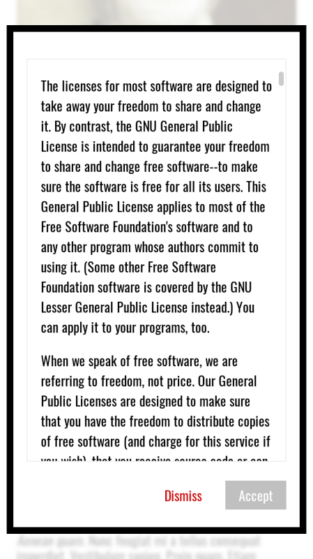

# rh-full-page-regulations

Widget for displaying full page consent (scroll down to enable accept – as seen on Google).

## Usage

```
git clone https://github.com/fedek6/rh-fast-landing
cd rh-full-page-regulations
npm install
grunt
cd public
```
You'll find your files in public directory.

## Preview



## Demo

You can check demo [here](https://realhe.ro/projects/rh-full-page-regulations/).